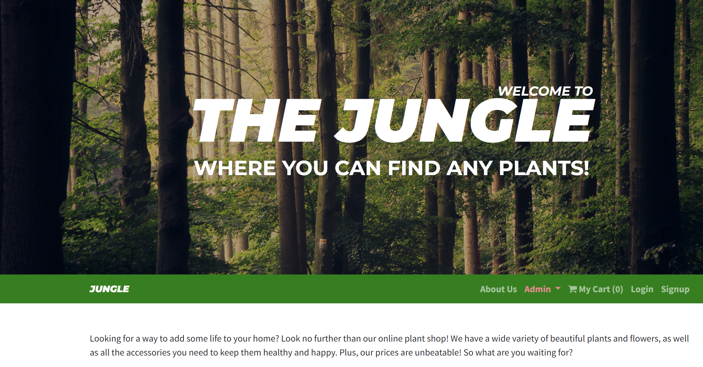
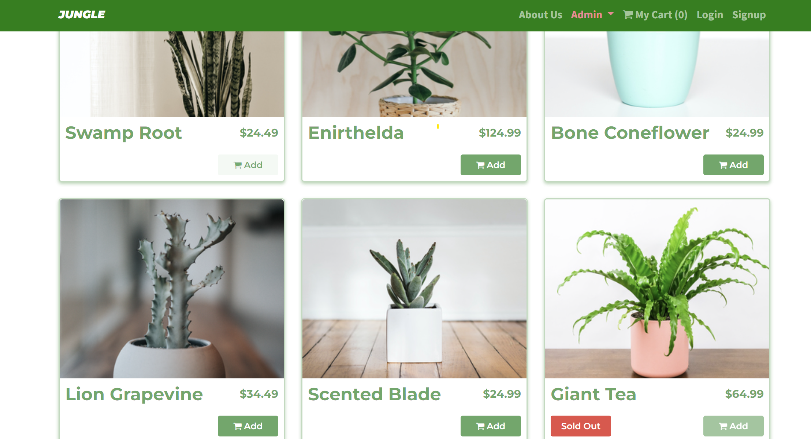
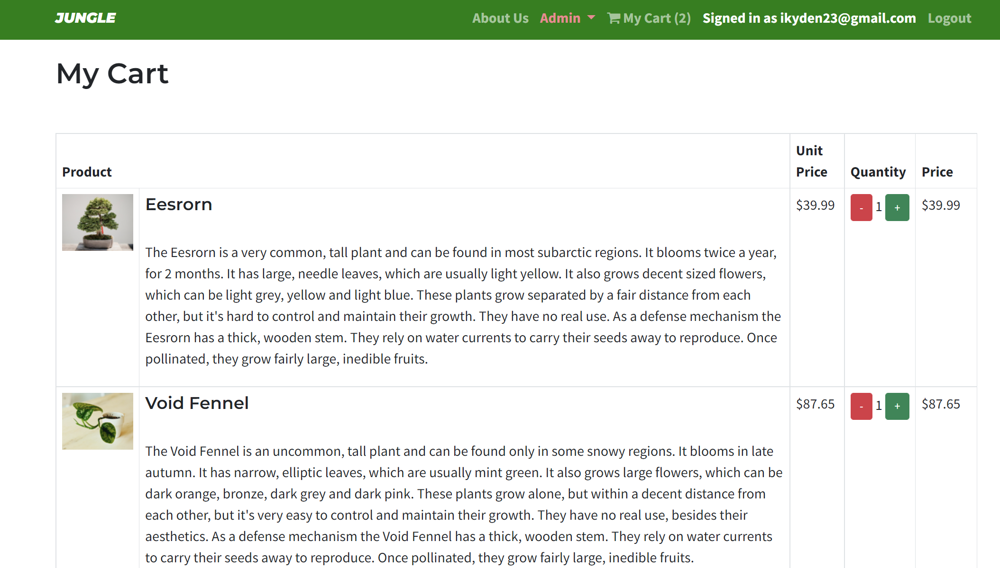
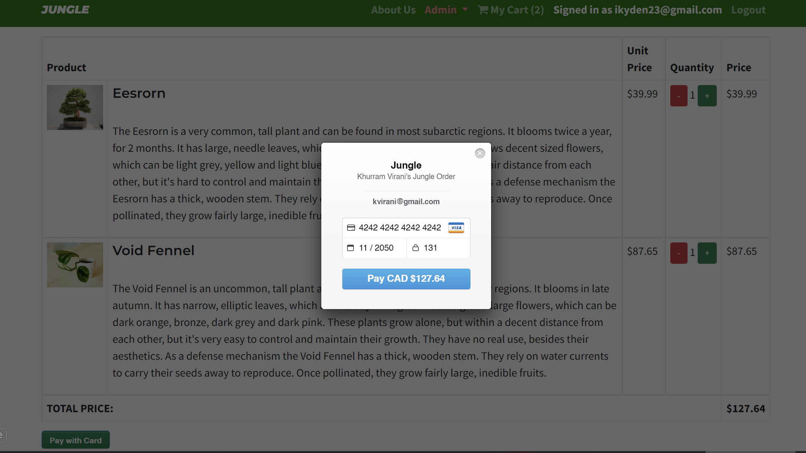
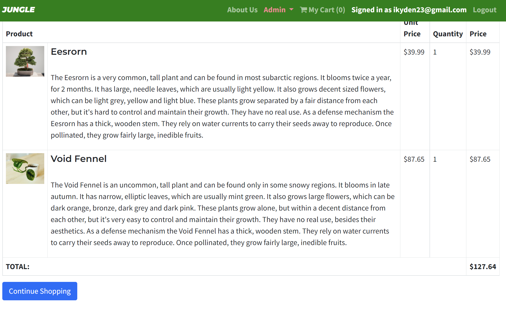
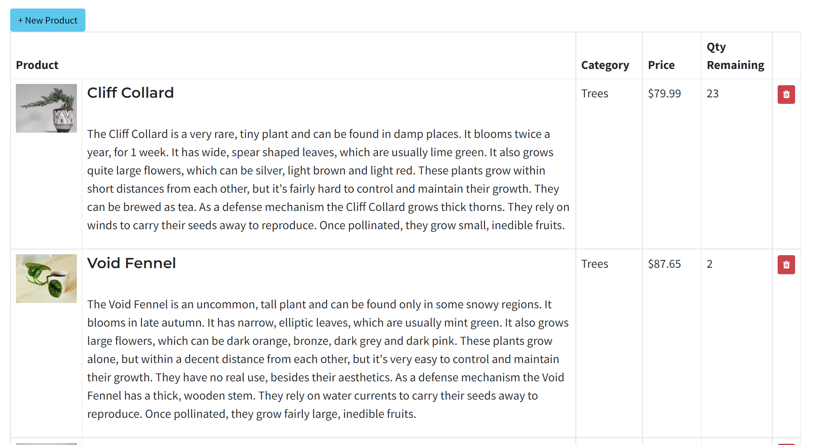

# Jungle

A mini e-commerce application built with Rails 6.1 for purposes of teaching Rails by example. Features browsing and add-to-cart capabilities for visitors, category and product creation when signed-in with Admin credentials, and bcrypt encryption for user passwords. Uses Stripe for test payments, and Rspec and Cypress for testing.

## Setup

1. Run `bundle install` to install dependencies
2. Create `config/database.yml` by copying `config/database.example.yml`
3. Create `config/secrets.yml` by copying `config/secrets.example.yml`
4. Run `bin/rails db:reset` to create, load and seed db
5. Run `bin/rails server` to start the server

## Product Showcase

- Current photo shows the main page on a wide screen.
- The main page has all the listed (by Admin or DB) products. With "Sold Out" badge for those that are out of stock.
- There is a personal cart for each user. It has a detailed and ordered outlook.
- The Jungle has the Stripe API installed to handle e-payment.
- After order is paid it shows the detailed summary of purchased order.
- Each product has a separate page. If user if logged in, he/she can see the email used for login.
- Admin has three protected pages with availability to add new products and categories to the shop.

## Database

This project uses a PostgreSQL database and ActiveRecord for queries.

## Stripe Testing

Use Credit Card # 4111 1111 1111 1111 for testing success scenarios.

More information in their docs: <https://stripe.com/docs/testing#cards>

## Dependencies

- Rails 6.1 [Rails Guide](http://guides.rubyonrails.org/v6.1/)
- Bootstrap 5
- PostgreSQL 9.x
- Stripe

### Made by [Kayden](https://github.com/iKayden)
